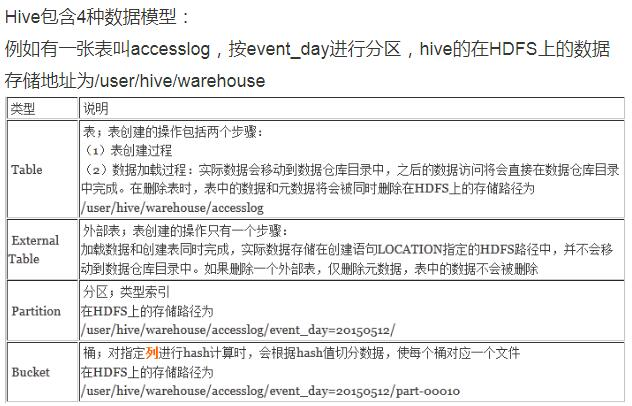
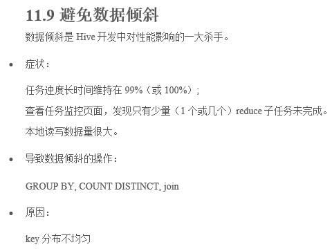
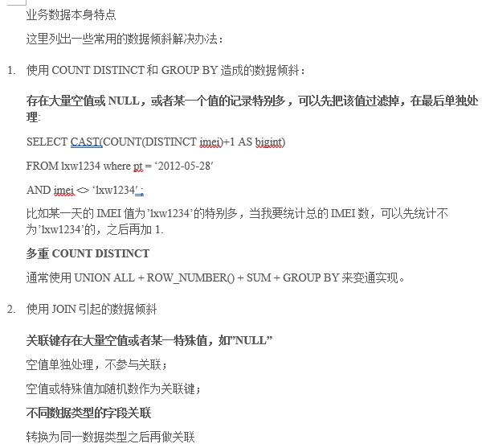

Hadoop 2.3, CDH 5.0.0 -> Hive 2.1, ORCFile or Parquet Columnar NoSQL, Presto Distributed SQL Engine

# Hive 2.1 基础知识
## 1. 用sql查询HDFS上的数据 
 
## 2. Hive的数据都存储在HDFS的路径/user/hive/warehouse下，一个表一个子目录，使用./hive命令进入Hive shell 
/home 
/system 
/user 
	下的/hive 
		下的/warehouse 
	下的/huang 
## 3. Hive里的数据类型 
integer 
float 
boolean 
struct，两个string 
map，key value 
array，数组 
 
当然可以使用delimiter或terminator指定row、col分隔符，使用create external table ... file ...指定由HDFS文件创建外部表，指定partitioned by创建分区字段。 
普通表的存储路径例子：hdfs://master_server/user/hive/warehouse/mydb.db/employees 
分区表的存储路径例子： 
hdfs://master_server/user/hive/warehouse/mydb.db/employees/country=CA/state=AB 
hdfs://master_server/user/hive/warehouse/mydb.db/employees/country=CA/state=BC 
hdfs://master_server/user/hive/warehouse/mydb.db/employees/country=US/state=AL 
hdfs://master_server/user/hive/warehouse/mydb.db/employees/country=US/state=AK 
## 4. Hive虽然作为Hadoop里的数据仓库，但它与传统的RDBMS比如Oracle相比依旧有很大的区别。它无法做到在记录行级别上的插入、删除和更新操作。它对自己表里的数据的唯一更新办法就是整批载入（bulk load）。原因：基于HDFS
hive不支持INSERT INTO, UPDATE, DELETE操作，这样的话，就不要很复杂的锁机制来读写数据。Hive仅支持覆盖重写整个表，示例如下： 
INSERT OVERWRITE TABLE t1 SELECT * FROM t2;
## 5. Hive不支持主键或者外键。不过Hive支持在列上建索引。
## 6. Hive的查询优化技巧 
### 6.1 在Hive里将aggr参数设置为true，可以显著地提升SELECT时进行group by统计count等分组计算的效率 
原因：aggr参数为false时，Hive先用SELECT将所有数据查出来，最后统一放到一台reduce节点机器上进行group by，这时所有的压力都压在这一台节点上；aggr为true时，Hive的SELECT会在每台节点上进行预group by，最后将group by后的数据放在reduce节点上，最终group by，缓解了最终的压力，将group by压力分摊，因此提升了效率。 
 
### 6.2 有一个hint，在Hive查询时使用，使用该hint或设置join参数，可以基于map-side joins的原理来优化Hive里的连接操作。该原理的思想是，传统的连接操作最后一定是在Reduce节点上完成的，所有的压力卡在这一台Reduce节点。但如果要连接的两个表一大一小，较小的表小到完全可以存放在HDFS里任意一台节点上，这时Hive会自动将小表复制到每台节点，然后让它跟大表在本地节点上直接连接（每台节点上都有完整的小表，和大表的一部分），最后将数据传送到Reduce节点，这样分摊压力后，可以极大地提升连接的效率。使用join参数后，Hive会自动判定当前连接操作是否适用于map-side joins，而判定的依据，本质上就是判断小表到底有多小、到底能不能放到HDFS的每台节点中去。通过指定filesize参数，我们可以告诉Hive，当小表小于25 MB时，就基于map-side joins对当前连接优化。
### 6.3 Hive也可以查看Explain Plan
### 6.4 设置参数mapred.job.reuse.jvm.num.tasks使得JVM在reducer中可以重用reuse，避免来回启动JVM浪费时间
### 6.5 设置参数hive.exec.parallel使得Hive中非相互依赖dependent的job可以并行执行
### 6.6 设置参数hive.exec.reducers.bytes.per.reducer开启多个reducer，这在in parallel地往同一张表中load数据时有用
## 7. Hive的权限控制
参考BMA-1笔记的“2.7.22.17	Hive中如何实现权限控制？”一节。
## 8. Hive SQL的优化技巧
参见BMA-1笔记“2.7.22.18	从哪些方面考虑对Hive SQL优化”一节。这里摘点重要的： 
### 在SELECT中，只拿需要的列，如果有，尽量使用分区过滤，少用SELECT 星。 
### 在分区剪裁中，当使用外关联时，如果将副表的过滤条件写在Where后面，那么就会先全表关联，之后再过滤，正确的写法是写在ON后面。 
### 合理使用Map Join或者Bucket Join。 
### 少用COUNT DISTINCT，数据量小的时候无所谓，数据量大的情况下，由于COUNT DISTINCT操作需要用一个Reduce Task来完成，这一个Reduce需要处理的数据量太大，就会导致整个Job很难完成，一般COUNT DISTINCT使用先GROUP BY再COUNT的方式替换。 
### 对同一张表的union all要比multi insert快的多，所以能用union all尽量用。
### 避免数据倾斜data skew，见下图
 
 
## 9. 借鉴Apache的open source package-HPL/SQL 0.3，配置上之后就可以在Hive里写stored  procedure，甚至支持variable cursor loop之类
比如业务上需要将Hive中的表和MySQL的表关联起来查询，或者需要往MySQL里写对Hive的监控分析的audit审计信息时

# Hive 2.1 高阶技巧
## a. 理解Hive中的这四个order by，sort by，distribute by，cluster by
 
 
 
 
## b. 行转列pivot和列转行unpivot
使用相关sql实现，参见https://blog.csdn.net/morexyoung/article/details/78916177
## c. Hive性能优化之ORCFile格式的索引–Row Group Index vs Bloom Filter Index
参见 lxw的大数据田地 网站，链接：http://lxw1234.com/archives/2016/04/632.htm#comments  文章标题同子目录标题
## d. Hive性能优化之使用ORCFile存储格式
Optimized Row Columnar, 就是一种列示存储，但又不是纯粹的列式存储，是会先分行组row group的，在row group里分columns和所有的row index。有很高的压缩比，有相关的metadata，这样就可以节省Hive在Map Reduce时的memory从而减少浪费资源加快查询和减少空间浪费。在每个stripe (group of row data)中有每个列的min/max/sum值、从而查询时可以过滤掉一部分stripe减少I/O，当然因为存在metadata所以需要CPU decoding但其实这部分CPU计算量cost是很少的。 
NoSQL-比如列式数据库还有一种strength是可以存储复杂的complex的数据结构，比如对于某一个视频的父类别的子类别的子类别的子类别一直下去，而常规的行式traditional database就需要多个字段来存储、就浪费了空间。因为NoSQL是按column存储的、所以每个column往往具备自同构性因此可以实现较高的压缩比。 
 
 
 
 
 
 
 
 
 
使用orcfiledump工具可以查看某个表的ORCFile的统计信息 
所有参考链接： 
https://www.cnblogs.com/ITtangtang/p/7677912.html 
http://lxw1234.com/archives/2016/04/630.htm 
Java写本地ORC文件(Hive2 API)：https://blog.csdn.net/nysyxxg/article/details/52241848 
## e. Partition和Bucket 分区和分桶的区别
参见链接博客园cnblogs - 小丑进场 - HIVE—索引、分区和分桶的区别 - 地址：https://www.cnblogs.com/LiCheng-/p/7420888.html 
使用partition有限制，因为HDFS太多分区后会崩溃，这时可以分桶。分桶直接就创建不同的文件了。分区对应的是很多子目录。 
索引和分区最大的区别就是索引不分割数据库，分区分割数据库。其实就是拿空间换时间。 
分区和分桶最大的区别就是分桶随机分割数据库，分区是非随机分割数据库。 
因为分桶是按照列的哈希函数进行分割的，相对比较平均；而分区是按照列的值来进行分割的，容易造成数据倾斜。 
其次两者的另一个区别就是分桶是对应不同的文件（细粒度），分区是对应不同的文件夹（粗粒度）。 
在其他数据库中，一般向分区表中插入数据时系统会校验数据是否符合该分区，如果不符合会报错。而在hive中，向某个分区中插入什么样的数据完全是由人来控制的，因为分区键是伪列，不实际存储在文件中，分区仅仅是构建出一个目录而已。 
## f. 动态分区dynamic partition
手动建分区根本忙不过来，需要动态分区，让Hive自己分区，尤其是按天或者小时就需要分区的时候更是，见链接https://www.cnblogs.com/iiwen/p/6479607.html 
## g. Hive的Join操作
搜索BMA-1笔记关键字“2.7.22.16	Hive的join分为哪两种，如何对Hive的join进行优化”和“何时事宜采用bucket map side join提升效率”，这里摘点重要的： 
首先，Hive中的join包括JOIN、LEFT JOIN、RIGHT JOIN、FULL JOIN、LEFT SEMI JOIN（以LEFT SEMI JOIN关键字前面的表为主表，返回主表的KEY也在副表中的记录、相当于IN EXISTS这种）、CROSS JOIN（笛卡儿积，除非特殊需求，并且数据量不是特别大的情况下，才可以慎用CROSS JOIN，否则，很难跑出正确的结果，或者JOB压根不能执行完，可能引发jvm的heap.size报错）。 
注意：Hive中Join的关联键必须在ON ()中指定，不能在Where中指定，否则就会先做笛卡尔积，再过滤，这会很糟。 
Hive中有三种Join的方式：Normal的Common/Shuffle/Reduce Join，Map Join还有SMB(Sort-Merge-Buket) Join。三种Join的区别和适用场景可以参见cnblogs博客园 - Raymoc - Hive的三种Join方式 - 链接：https://www.cnblogs.com/raymoc/p/5323824.html 
Reduce Join就是两边表的数据量都很大，需要注意，Hive中多表Join时，是有几次Join就创建几次MR job，比如a b c三表join，第一个MR用来join起a和b，第二个MR用来join起a、b join的结果和c Join的时候使用要join的列作为key，剩余列作为value，这样能make sure要join的两张表的相同key的列都可以跑到同一台reducer上面去处理，不会出问题。 
Map Join就是一张大表一张小表（是不是小表的标准，在Hive里默认是25MB，可以用参数设置），把小表直接拷贝到map的那台机器上和大表join 
Bucket Map Join就是用bucket实现一个bucket和另一个bucket来join 
现在的Hive已经很智能了，你参数放开之后它都会自动去找合适的join方式。

# Hive 2.1 案例
## 整体数据仓库的架构
处理之前的导入：通过 hadoop 命令将日志数据导入到 hdfs 文件系统， 
处理完成之后的导出：利用 hive 处理完成之后的数据，通过 sqoop 导出到 mysql或HBase 数据库中，以供报表层使用。 
## 你在项目中遇到了哪些难题，是怎么解决的？
某些任务执行时间过长，且失败率过高，检查日志后发现没有执行完就失败，原因出在hadoop 的 job 的 timeout 过短（相对于集群的能力来说），设置长一点即可 
其实就是-Dmapreduce.task.timeout=1200000单位是毫秒 
链接：http://www.tuicool.com/articles/EBFFve
## 一个网络商城 1 天大概产生多少 G 的日志？
4tb
## 你们大概有多少条日志记录（在不清洗的情况下）？
7-8 百万条。开发时使用的是部分数据，不是全量数据，有将近一亿或8、9 千万吧
## 你们日访问量大概有多少个？
百万
## 你们注册数大概多少？
不清楚，几十万吧 
## 你们的日志是不是除了 apache 的访问日志是不是还有其他的日志？
关注信息
## 你们的集群多少台,数据量多大,吞吐量是多大,每天处理多少G 的数据？
之前我们公司采用双节点的Oracle RAC，IBM小型机，由于成本和性能的压力，转为Hadoop 
目前我们整个的数据仓库平台(EDW)都基于Hadoop    有30台机器，数据从装载服务器批量导入到集群，周期为天。数据经过处理以后放入由Hive搭建的数据仓库，数据仓库的查询统计结果会放入由HBase搭建的集群，由HBase负责为应用提供服务接口。前端Portal会通过API连接到HBase 
目前集群有700 TB的容量，一天300 GB的数据增量（包括分析数据和业务数据）。使用了3年。 
默认情况下, Hive的元数据保存在了内嵌的 derby 数据库里, 但一般情况下生产环境使用 MySQL 来存放 Hive 元数据。 
## 你们集群中机器每台的配置怎么样，比如内存、CPU、存储等等，都怎么分布的（地理上，配机架感知了吗）？
考虑的时候，分Namenode这类管理节点，和Datanode这类普通节点，前者对内存要求高、需要非常可靠的硬件，所以一般还是推荐使用小型机之类内存在48GB到64GB甚至128MB的，不过对存储要求不太高；后者对存储要求较高，要求硬件可随时方便替换，一般最好也是能用至少32GB内存的机器来配置。 
反正一般不建议直接用普通的PC机搭建Hadoop集群，除非是实验性质或者所处理的问题真的非常非常小。一般6到8节点的小型集群也建议用稍微专业的机器组建。20台所有的集群已经可以胜任绝大多数企业的需要。 
当然，搭建时还需考虑你是I/O密集型的应用（比如ETL等）还是计算密集型的应用（比如数据挖掘、机器学习）。 
## 如何优化Hive，对Hive的一些优化的案例-1笔记
比如应付数据倾斜，使用分区等。
## Hive中实现权限控制-1笔记
## Hive HQL的优化和stored procedure-1笔记
## 整体你们项目用Hive干了些啥事儿描述一下
用Hive一方面业务部分有日常的提取数据需求，写HQL提数 
一方面构建real time的recommendation system（就是sales representative在customer的现场需要分钟级获取到推荐内容，做customer interaction的时候，录入customer的一些profile等等之后）。 
### a. Global Core X - Bayer
参考链接https://blog.csdn.net/morexyoung/article/details/78916177  对应CSDN - morexyoung的博客 - 大数据之Hive之扩展项目Youtube案例<一><二>和<三>，情况介绍如下： 
是Bayer的药品网站，全国5000个Sales Representative都会带着iPad出去拜访interaction customer，然后访问网站，需要统计相关药品的热度view、类别category、相关的sales representative (user)情况。 
 
下面视频表就是药品信息表： 
 
用户表就是sales representative表： 
 
所做的ETL cleanup work包括： 
 
项目使用Intellij开发，基于Java实现，创建相关package和function，还有相关的Mapper和Runner函数，针对source flat file中的每一行偏移量的数据进行处理，最后输出到处理后的目录，具体代码参见链接<二> https://blog.csdn.net/morexyoung/article/details/78916208 
 
ori和orc表数据是一致的，因为两张表会按照uploader也就是user_id进行关联，因此按照user_id进行分bucket， 
在入Hive表的时候，一定要保证user id紧挨着的数据位于同一个stripe中，所以一般我们会借助DISTRIBUTE BY id SORT BY id;实现，如下： 
 
统计药品访问数Top10 
统计药品类别热度Top10-统计每个类别有多少个药品，显示出包含药品最多的前10个类别，我们需要按照类别group by聚合，然后count组内的videoId个数即可。因为当前表结构为：一个视频对应一个或多个类别，而所有的类别信息都存储在一个字段中用&符号分隔，所以如果要group by类别，需要先将类别进行列转行(展开)，然后再进行count即可。 
其他查询需求还借用到临时表temp再join之类的操作，具体参见链接<三> https://blog.csdn.net/morexyoung/article/details/78916223 
期间因为两张表经常会按照user id进行关联，其实user id的设计是有规律的，是按照国家-省份-市级-县级-编号来走的，所以经常需要进行范围查询或单独的=查询，因此在两张表的user id字段上创建了row group index，这样查询时就能跳过一部分stripe (groups of row data) 
但是如果有时候要查询整个国家或者范围查询的跨度where的id range比较大时，row group index就失去了它的意义（你现在没法跳过大部分stripes了），这时就可以采取bloom filter index - 它特别擅长判断某个值是否在指定集合中存在。一般我们通过Row Group Index和Bloom Filter Index的双重索引优化，就可以扫描很少的记录、跳过大部分stripes，大大节省了Map Task的执行时间和资源。 
我们项目的Hive库设计的Stripe大小为256MB (一般设地跟HDFS的block大小一致)，stripe的index为10000条一个，即10000条rows又组建一个小的row group在stripe里。 
我们上面用Map Reduce处理完原始数据之后，使用Java调org.apache.orc.OrcFile的相关function比如OrcFile.createWriter来创建ORCFile，然后跑到Hive里用load来加载进表。 
原先有500 GB的plain text user信息使用ORCFile之后用100 GB即可存储。 
利用 hive 处理完成之后的数据，通过 sqoop 导出到 mysql 数据库中，以供报表层使用。 
我们还有一张表是interaction主表、记录所有的拜访。对这张表进行了partition和bucket，按照month来partition，对每个partition（对应Hive的每个文件夹）再按照user id就是sales rep id来分bucket从而打散数据。 
关联查询时，使用一些优化技巧比如放开一些Hive的参数，使得Reduce Join可以转化为Map Join，甚至可以使用Bucket Map Join进一步优化（经常关联的字段，比如interaction detail表和interaction general表的interaction id可以用bucket弄之后引入bucket map join来关联）。 
### b. Recommendation & GPS analysis system
用到了Hive编写UDF来从网上的open source IP库来查IP地址做geo match，看看与对应的IP地址之间的距离，以及我们设定的距离，看判断是否真的有拜访interaction, in case fraud.
使用UDF就是重写evaluate方法，继承.UDF class 
然后在Hive的SELECT时对每一行数据都会应用到UDF来判断。

# Future Research
## a. 对Hive而言，除了有ORCFile这种高压缩比的列式存储外，还有Parquet格式，后者相较于前者的更优势的地方是天生支持complex data structures存储和嵌套nested data structures，介绍文章：CSDN博客 - Parquet与ORC：高性能列式存储格式 - https://blog.csdn.net/yu616568/article/details/51868447
## b. UDF，具体怎么写没试验 
参考链接： 
简书 - Hive简易教程 - 自定义UDF - 示例：实现转化IP地址为二进制格式 - 链接：https://www.jianshu.com/p/7f8329443aae 
CSDN - bitcarmanlee的博客 - hive udf开发超详细手把手教程 - 链接：https://blog.csdn.net/bitcarmanlee/article/details/51249260 
CSDN - YQlakers的博客 - Hive的UDF是什么？ - 链接：https://blog.csdn.net/yqlakers/article/details/70211522
## c. Distributed NoSQL <Hive> (ORCFile or Parquet, columnar storage) + Distributed SQL Engine <Presto>
参看文章“环境搭建 Hadoop+Hive(orcfile格式)+Presto实现大数据存储查询”，链接：https://www.cnblogs.com/nyzhai/p/6102423.html